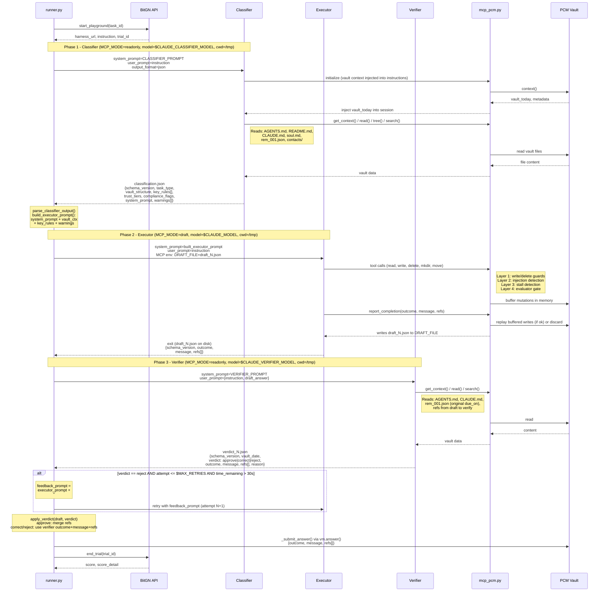
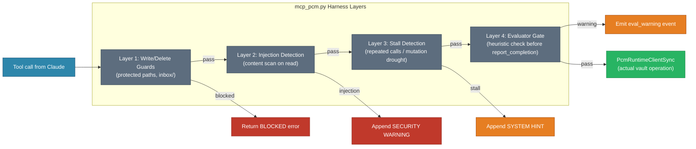

# cc-agent — Multi-Agent Pipeline Data Flow (MULTI_AGENT=1)



## Параметры запуска агентов

| Параметр | Classifier | Executor | Verifier |
|----------|-----------|----------|----------|
| `MCP_MODE` | `readonly` | `draft` | `readonly` |
| `model` | `$CLAUDE_CLASSIFIER_MODEL` (default: haiku) | `$CLAUDE_MODEL` | `$CLAUDE_VERIFIER_MODEL` (auto: отличается от executor) |
| `cwd` | `/tmp` | `/tmp` | `/tmp` |
| `output_format` | `json` (envelope unwrap) | — | `json` (envelope unwrap) |
| `timeout` | `$CLASSIFIER_TIMEOUT_S` (60s) | динамически из бюджета | `$VERIFIER_TIMEOUT_S` (90s) |

> **cwd=/tmp**: все агенты запускаются из нейтрального каталога, чтобы Claude Code не поднимался вверх по дереву и не подхватил CLAUDE.md репозитория. Это не `--bare` флаг (он требует ключ) — именно переопределение рабочей директории.

> **Retry**: повтор executor при `verdict=reject` управляется `$MAX_RETRIES` (default: 1) и жёстким порогом `time_remaining > 30s` (hardcoded в `_executor_verify_loop`).

## Схемы данных обмена между агентами

### Classifier → runner.py (`classification.json`)

```json
{
  "schema_version": 1,
  "task_type": "inbox|email|lookup|delete|capture|other",
  "vault_structure": "Personal CRM: accounts/, contacts/, ...",
  "key_rules": ["exact rule quoted from AGENTS.md"],
  "trust_tiers": {},
  "compliance_flags": {"acct_001": ["nda_signed"]},
  "system_prompt": "You are a CRM executor. Vault root is /. Steps: ...",
  "warnings": ["external_send_guard on acct_004 — informational"]
}
```

### runner.py → Executor (system_prompt)

```
{classification.system_prompt}

## Vault context
{classification.vault_structure}

## Key rules for this task
- {classification.key_rules[0]}
- ...

## Warnings
- {classification.warnings[0]}
- ...
```

При retry добавляется:
```
## Feedback from verifier (attempt N)
{verdict.reason}
Fix the issues above and try again.
```

### Executor → runner.py (`draft_N.json`, через report_completion в MCP)

```json
{
  "schema_version": 1,
  "outcome": "ok|clarification|security|unsupported",
  "message": "Email queued for Luuk Vermeulen",
  "refs": ["/outbox/42.json", "/outbox/seq.json"]
}
```

### runner.py → Verifier (user_prompt)

```json
{
  "instruction": "<original task instruction>",
  "draft_answer": {
    "schema_version": 1,
    "outcome": "ok",
    "message": "...",
    "refs": [...]
  }
}
```

### Verifier → runner.py (`verdict_N.json`)

```json
{
  "schema_version": 1,
  "vault_date": "2026-03-17",
  "verdict": "approve|correct|reject",
  "outcome": "ok|clarification|security|unsupported",
  "message": "corrected message if verdict=correct/reject",
  "refs": ["/outbox/42.json", "/accounts/acct_004.json"],
  "reason": "VAULT DATE: 2026-03-17. Executor used system clock..."
}
```

## Harness Layers in mcp_pcm.py


