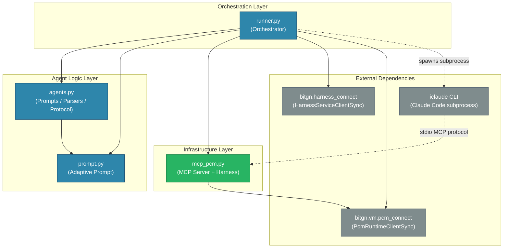

# cc-agent — Component Dependency Graph

## Legend

| Color | Layer |
|-------|-------|
| Blue (#2E86AB) | Orchestration / Agent Logic |
| Green (#28B463) | Infrastructure (MCP/Harness) |
| Gray (#7F8C8D) | External dependencies |

Solid arrows = Python imports.
Dashed arrows = runtime subprocess / IPC communication.
