# Архитектурный аудит агента pac1-py

> Дата: 2026-04-03 | Ветка: dev | Последний FIX: FIX-182 | Цель: стабильные 90-95% на vault-задачах

---

## 1. Общая архитектура

### 1.1 Поток выполнения

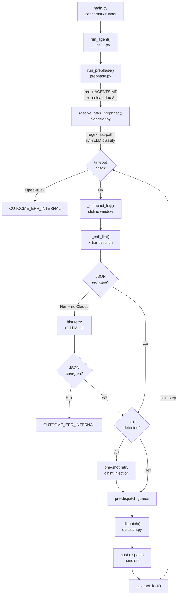

### 1.2 Трёхуровневый LLM dispatch

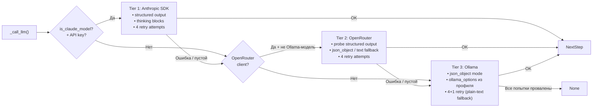

### 1.3 Размеры модулей (верифицировано)

| Файл | Строк | Назначение |
|------|-------|------------|
| `main.py` | 294 | Benchmark runner, статистика |
| `agent/__init__.py` | 41 | Entry point: prephase → classify → loop |
| `agent/loop.py` | 1350 | Основной цикл, JSON extraction, stall detection, compaction |
| `agent/dispatch.py` | 597 | LLM-клиенты, code_eval sandbox, tool dispatch |
| `agent/classifier.py` | 342 | Regex + LLM классификация типов задач |
| `agent/prephase.py` | 267 | Vault discovery: tree, AGENTS.MD, preload |
| `agent/models.py` | 163 | Pydantic-схемы: NextStep, Req_*, TaskRoute |
| `agent/prompt.py` | 246 | Системный промпт (~12 500 символов, ~3 200 токенов) |
| **Итого** | **~3 300** | |

---

## 2. Корневые причины нестабильности

### 2.1 Карта источников non-determinism

```mermaid
flowchart TD
    ND["NON-DETERMINISM<br/>от запуска к запуску"]

    ND --> T["CRIT: Temperature > 0<br/>без seed"]
    ND --> R["CRIT: Semantic Router<br/>без кэша"]
    ND --> P["HIGH: Промпт ~3200 tok<br/>противоречия + неоднозначности"]
    ND --> J["HIGH: JSON extraction<br/>order-dependent"]
    ND --> S["HIGH: Stall hints<br/>feedback loop"]
    ND --> TO["HIGH: Wall-clock timeout<br/>system-dependent"]
    ND --> C["MED: Capability cache<br/>in-memory only"]
    ND --> LC["MED: Log compaction<br/>потеря контекста"]

    T --> T1["default: T=0.35, no seed"]
    T --> T2["think: T=0.55, no seed"]
    T --> T3["Anthropic: T не передаётся вообще"]

    R --> R1["LLM вызов перед каждым<br/>run_loop, не кэшируется"]
    R --> R2["Ошибка сети → fallback<br/>на EXECUTE (пропуск проверки)"]

    P --> P1["OTP elevation vs<br/>MANDATORY verify"]
    P --> P2["14 неоднозначных правил"]
    P --> P3["Правила далеко от<br/>точки применения"]

    style T fill:#ff6b6b,color:#fff
    style R fill:#ff6b6b,color:#fff
    style P fill:#ffd93d,color:#333
    style J fill:#ffd93d,color:#333
    style S fill:#ffd93d,color:#333
    style TO fill:#ffd93d,color:#333
    style C fill:#6bcb77,color:#333
    style LC fill:#6bcb77,color:#333
```

### 2.2 КРИТИЧЕСКОЕ: Temperature и sampling

**Верифицировано по `models.json` и коду dispatch:**

| Профиль | Temperature | Seed | Где используется |
|---------|-------------|------|------------------|
| default | 0.35 | — | Основной агентский цикл |
| think | 0.55 | — | Задачи анализа/distill |
| long_ctx | 0.20 | — | Bulk-операции |
| classifier | 0.0 | 0 | Классификация типа задачи |
| coder | 0.1 | 0 | Генерация кода (sub-agent) |
| **Anthropic** | **не передаётся** | **—** | **Claude модели** |

**Проблема:** Основные рабочие профили (`default`, `think`) не имеют `seed`. Температура >0 означает стохастический sampling. Одинаковый промпт → разные ответы.

> **Примечание:** в `models.json` комментарий `_ollama_tuning_rationale` (строка 18) утверждает `classifier uses seed=42`, но реальный профиль (строка 25) содержит `seed=0`. Документация внутри файла противоречит фактическому значению.

**Верификация Anthropic tier** (`loop.py:593-600`):
```python
create_kwargs: dict = dict(
    model=ant_model, system=system, messages=messages, max_tokens=max_tokens,
)
if thinking_budget:
    create_kwargs["thinking"] = {"type": "enabled", "budget_tokens": thinking_budget}
```
Ни `temperature`, ни `seed` не передаются в Anthropic SDK — модель использует свой дефолт.

**Верификация Ollama tier** (`loop.py:656-658`):
```python
_opts = cfg.get("ollama_options")
if _opts is not None:
    extra["options"] = _opts
```
Temperature передаётся через `ollama_options` → `extra_body["options"]`. Seed передаётся только для classifier и coder профилей.

### 2.3 КРИТИЧЕСКОЕ: Semantic Router без кэширования

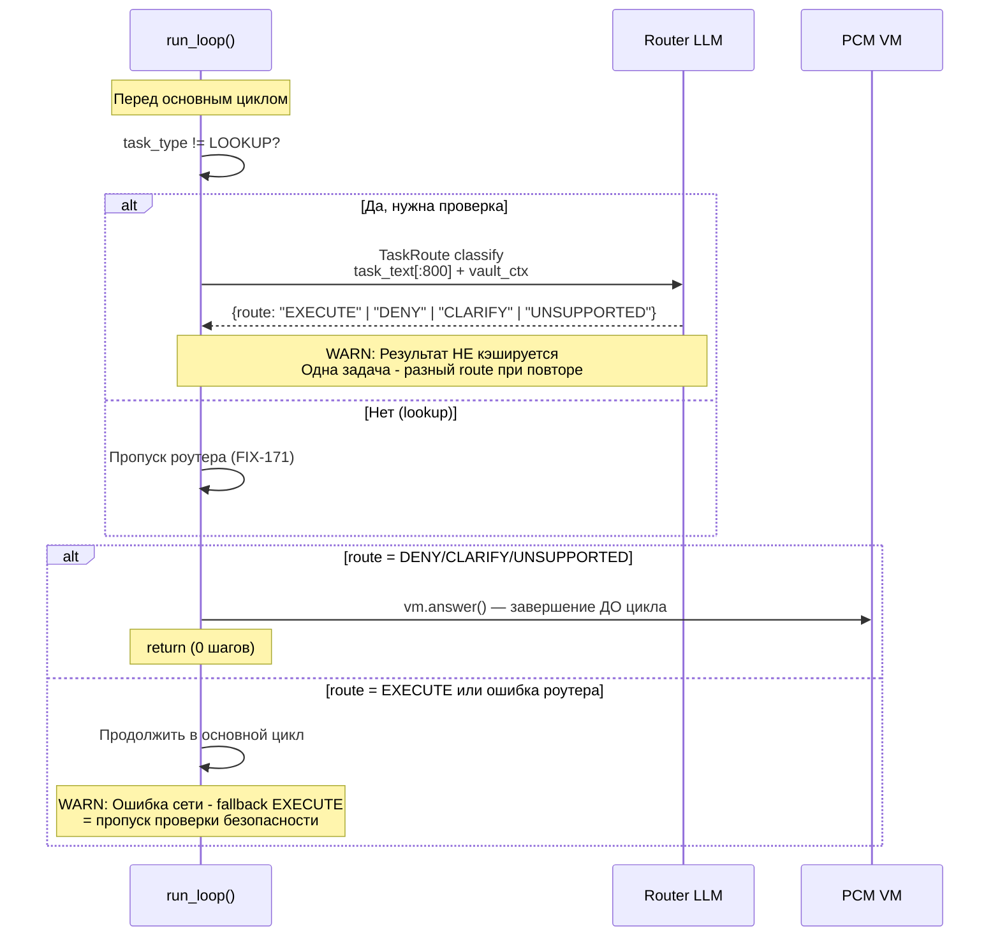

**Верифицировано по `loop.py:994-1036`:**
- Router вызывается каждый раз перед циклом (строка 1022)
- `max_completion_tokens=512`, `response_format={"type": "json_object"}` (строка 1025-1026)
- При ошибке: `_route_raw = None` → дефолт EXECUTE (строка 1035-1036)
- Нет `dict`/`cache` для хранения результата между запусками

### 2.4 ВЫСОКОЕ: Промпт — противоречия и перегрузка

**Размер промпта (верифицировано, `prompt.py`):**
- 246 строк, ~12 500 символов, ~3 200 токенов
- 6 директив NEVER + ~20 "Do NOT" запретов, 5 директив ALWAYS, 6 директив MUST, 3 секции CRITICAL + 2 IMPORTANT + 3 MANDATORY

**Выявленные противоречия (верифицировано по номерам строк):**

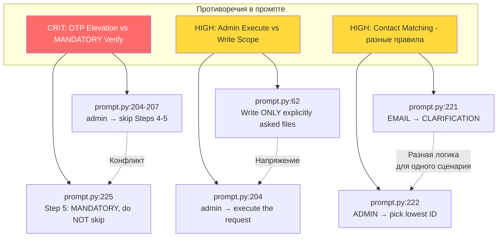

**Противоречие #1 (критическое):**
- `prompt.py:204-207`: admin channel email sends → "skip Steps 4-5 (no email sender to verify — admin is trusted)"
- `prompt.py:225`: "Step 5 (email only): Verify company — MANDATORY, do NOT skip"
- LLM может выбрать любую из двух интерпретаций → разный outcome

**Неоднозначности (14 выявлено, ключевые):**

| # | Правило | Строка | Проблема |
|---|---------|--------|----------|
| 1 | Формат "From:"/"Channel:" | 163-164 | Case-sensitive? Пробелы допустимы? Regex не задан |
| 2 | "One sentence" current_state | 14 | Нет лимита длины |
| 3 | "Lowest numeric ID" | 222 | Лексикографическая vs числовая сортировка |
| 4 | "N_days + 8" при reschedule | 127-128 | Как парсить "3 months"? Не специфицировано |
| 5 | OTP token format | 192 | Формат `<token>` не определён (длина, charset) |
| 6 | "Blacklist handle" | 173 | Формат файла docs/channels/ не описан |
| 7 | "Valid / non-marked handle" | 175 | Что делает handle "valid"? Нет определения |
| 8 | Precision instructions | 121-122 | "Only X" — включать единицы измерения? |

### 2.5 ВЫСОКОЕ: run_loop() — God Function

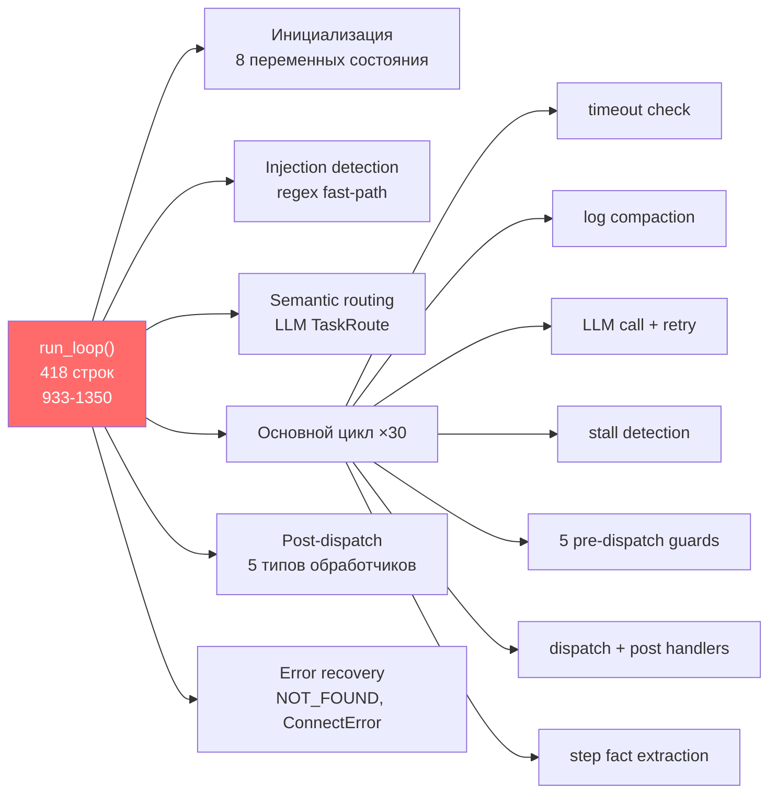

**Верифицировано:** `run_loop()` начинается на строке 933 и заканчивается на строке 1350 — **418 строк**. Глубина вложенности до 6 уровней (if внутри try внутри for внутри if).

**Переменные состояния (верифицировано по строкам 951-971):**
- `_action_fingerprints: deque(maxlen=6)` — stall detection
- `_steps_since_write: int` — счётчик шагов без мутаций
- `_error_counts: Counter` — (tool, path, code) → count
- `_stall_hint_active: bool` — флаг активного hint
- `_step_facts: list[_StepFact]` — факты для digest
- `_inbox_read_count: int` — счётчик чтений inbox/
- `_done_ops: list[str]` — server-authoritative ledger
- `_search_retry_counts: dict` — счётчик retry поиска

### 2.6 ВЫСОКОЕ: 8-уровневый JSON extraction

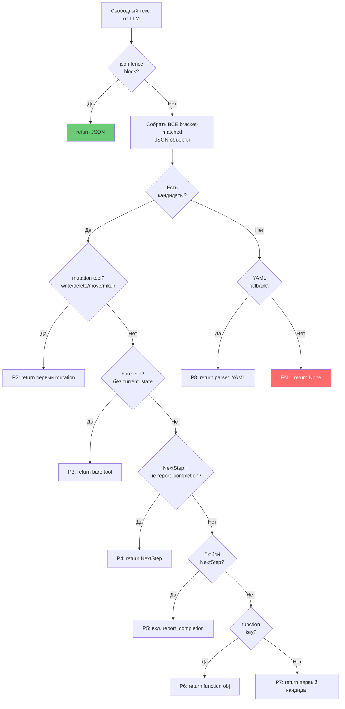

**Проблема non-determinism (верифицировано, `loop.py:392-416`):**

Если LLM выдаёт несколько JSON-объектов, выбор зависит от **порядка в тексте**. Пример:
- Ответ: `{tool:write, path:/a}...{tool:report_completion}` → приоритет 2: возвращается write
- Ответ: `{current_state:..., function:{tool:report_completion}}...{tool:write, path:/a}` → приоритет 2: mutation tool write всё равно выигрывает

Но: `{current_state:..., function:{tool:read}}...{current_state:..., function:{tool:report_completion}}` → приоритет 4: первый NextStep без report_completion. Порядок в тексте решает.

### 2.7 СРЕДНЕЕ: Stall detection → feedback loop

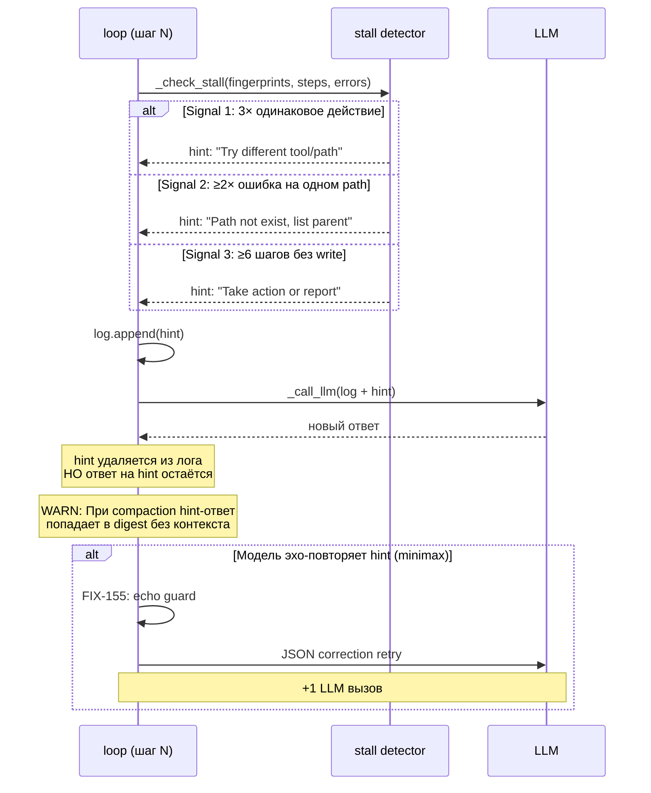

**Верифицировано по `loop.py:674-727`:** Три сигнала, все task-agnostic. Hint включает контекст из `_step_facts` — меняется от задачи к задаче.

### 2.8 СРЕДНЕЕ: Wall-clock timeout

**Верифицировано:** `TASK_TIMEOUT_S = int(os.environ.get("TASK_TIMEOUT_S", "180"))` (loop.py:30).

Проверка на строке 1080: `elapsed_task = time.time() - task_start`. Это wall-clock, не step-based. Под нагрузкой (медленный GPU, сетевые задержки) одна задача может успеть за 180с, а та же задача при следующем запуске — нет.

Max steps = 30 (строка 949) — это step-based лимит, но wall-clock timeout срабатывает раньше при медленных LLM-ответах.

---

## 3. Архитектурные проблемы

### 3.1 Reactive patching: ~182 FIX'а на ~3300 строк

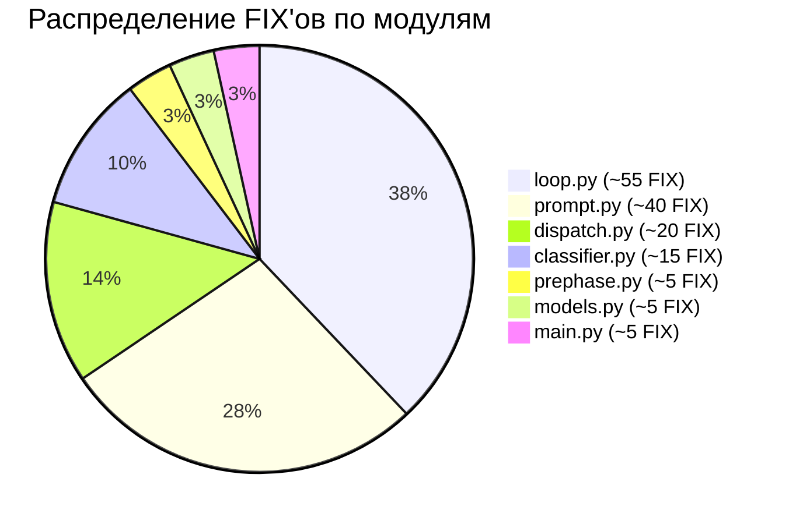

**Паттерн:** Каждый FIX решает конкретный провал теста (t01..t30), но:
- Усложняет код (новые ветвления)
- Удлиняет промпт (новые правила)
- Может сломать другие тесты (side effects)
- Увеличивает cognitive load для LLM (больше инструкций = ниже compliance)

### 3.2 Отсутствие программных гарантий

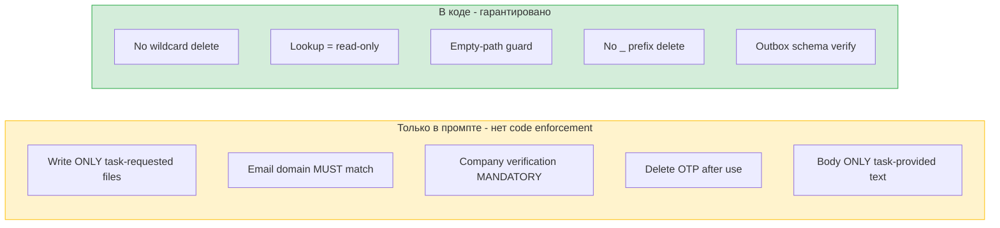

### 3.3 Prephase контекст нестабилен

**Верифицировано по `prephase.py`:** `_filter_agents_md()` фильтрует AGENTS.MD по word overlap с task_text, бюджет 2500 символов. Greedy filling от highest-scoring секций.

**Проблема:** разные формулировки одной задачи → разные секции AGENTS.MD попадают в контекст → модель получает разный vault context → разное поведение.

### 3.4 Anthropic tier: нет JSON extraction fallback

**Верифицировано по `loop.py:628-632`:**
```python
try:
    return NextStep.model_validate_json(raw), ...
except (ValidationError, ValueError) as e:
    return None, ...  # сразу None, без _extract_json_from_text()
```

И далее `loop.py:1111`:
```python
if job is None and not is_claude_model(model):  # retry только для НЕ-Claude
```

Если Claude вернёт невалидный JSON → **нет retry**, нет fallback → `OUTCOME_ERR_INTERNAL`. Для OpenRouter/Ollama есть 8-уровневый extraction + hint retry.

---

## 4. Классификация задач

### 4.1 Regex → LLM pipeline

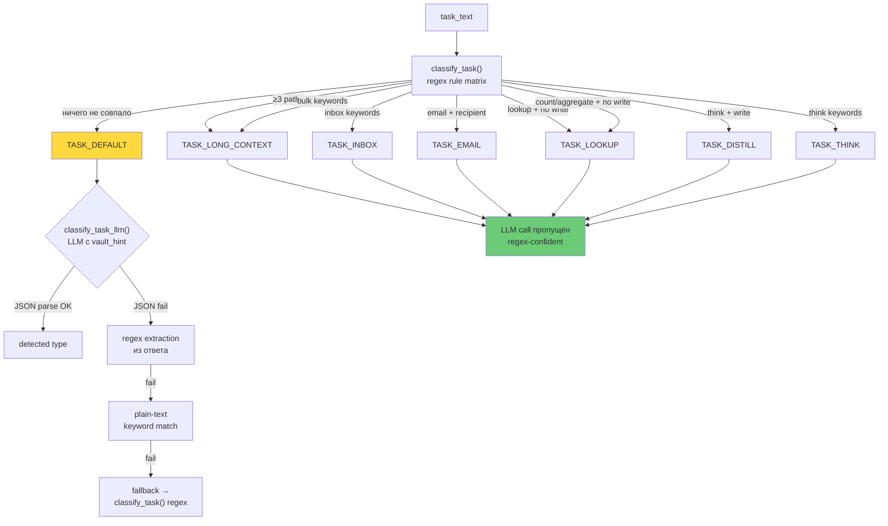

**Верифицировано по `classifier.py:225-231`:** Если regex возвращает не-default тип → LLM call пропускается. LLM вызывается только когда regex не уверен (default).

**Classifier profile:** `temperature=0.0, seed=0` → **почти детерминирован** для Ollama (seed=0, не лучший выбор — см. примечание в 2.2). Для Anthropic/OpenRouter seed не передаётся.

### 4.2 Rule matrix (верифицировано)

| Приоритет | Правило | must | must_not | Результат |
|-----------|---------|------|----------|-----------|
| 0 | ≥3 explicit paths | `_PATH_RE ×3` | — | LONG_CONTEXT |
| 1 | bulk-keywords | `_BULK_RE` | — | LONG_CONTEXT |
| 2 | inbox-keywords | `_INBOX_RE` | `_BULK_RE` | INBOX |
| 3 | email-keywords | `_EMAIL_RE` | `_BULK_RE`, `_INBOX_RE` | EMAIL |
| 4 | lookup-keywords | `_LOOKUP_RE` | `_BULK_RE`, `_INBOX_RE`, `_EMAIL_RE`, `_WRITE_VERBS_RE` | LOOKUP |
| 4b | count-query | `_COUNT_QUERY_RE` | `_BULK_RE`, `_INBOX_RE`, `_EMAIL_RE`, `_WRITE_VERBS_RE` | LOOKUP |
| 5 | distill | `_THINK_WORDS`, `_WRITE_VERBS_RE` | `_BULK_RE`, `_INBOX_RE`, `_EMAIL_RE` | DISTILL |
| 6 | think-keywords | `_THINK_WORDS` | `_BULK_RE` | THINK |
| — | default | — | — | DEFAULT |

---

## 5. Потоки данных в основном цикле

### 5.1 Состояние и его эволюция

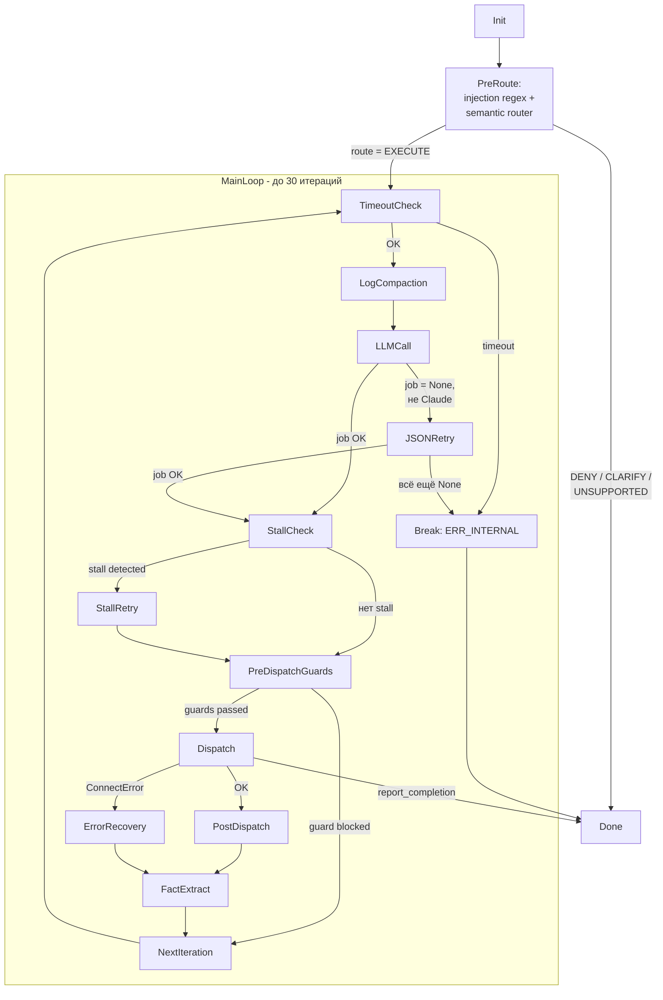

### 5.2 Log compaction: что сохраняется, что теряется

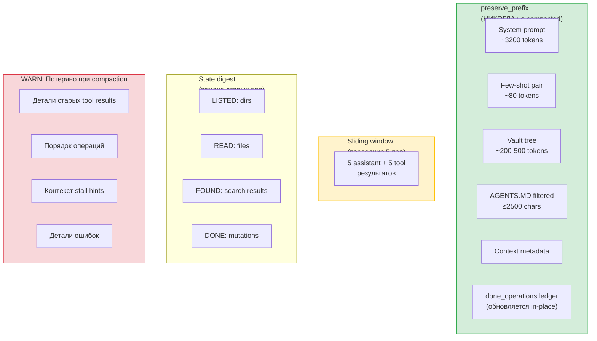

---

## 6. Конфигурация моделей

### 6.1 Архитектура multi-model routing

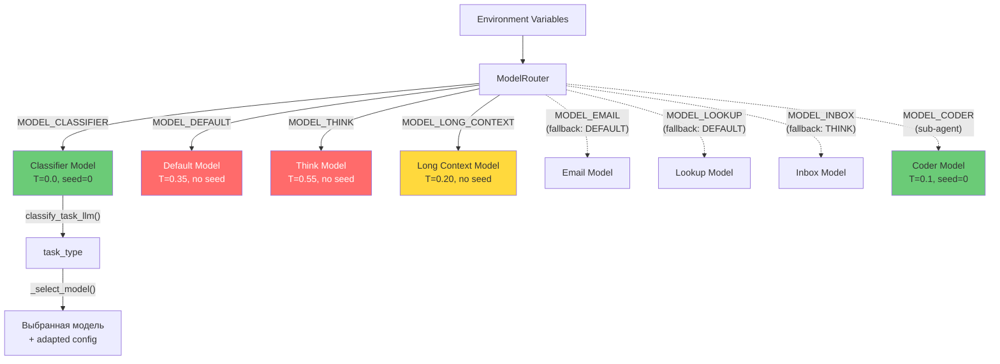

**Зелёный** = детерминирован (seed). **Красный** = non-deterministic (no seed). **Жёлтый** = частично стабилен (low temp).

### 6.2 Модели в models.json (верифицировано)

**Ollama Cloud (15 моделей):** minimax-m2.7, qwen3.5, qwen3.5:397b, ministral-3 (3b/8b/14b), nemotron-3-super, nemotron-3-nano:30b, glm-5, kimi-k2.5, kimi-k2-thinking, gpt-oss (20b/120b), deepseek-v3.1:671b, rnj-1:8b — все max_completion_tokens=4000, все используют профили default/think/long_ctx/classifier/coder.

**Anthropic (3 модели):** haiku-4.5 (thinking_budget=2000), sonnet-4.6 (4000), opus-4.6 (8000) — max_completion_tokens=16384.

**OpenRouter (2 модели):** qwen/qwen3.5-9b, meta-llama/llama-3.3-70b-instruct — max_completion_tokens=4000.

---

## 7. Retry и error recovery

### 7.1 Полная карта retry paths

```mermaid
flowchart TD
    STEP["Один шаг<br/>основного цикла"] --> CALL1["_call_llm()<br/>первичный вызов"]

    CALL1 --> ANT["Anthropic tier<br/>до 4 попыток"]
    ANT --> |"fail/empty"| OR["OpenRouter tier<br/>до 4 попыток"]
    OR --> |"fail/empty"| OLL["Ollama tier<br/>до 4 попыток"]
    OLL --> |"fail"| OLL_PT["Ollama plain-text<br/>1 попытка без format"]

    ANT --> |OK| RESULT1
    OR --> |OK| RESULT1
    OLL --> |OK| RESULT1
    OLL_PT --> |OK| RESULT1
    OLL_PT --> |fail| NONE1["job = None"]

    RESULT1["NextStep"] --> STALL{"Stall<br/>detected?"}
    NONE1 --> HINT{"не Claude?"}

    HINT --> |Да| CALL2["_call_llm()<br/>с JSON correction hint"]
    HINT --> |Нет (Claude)| FAIL["OUTCOME_ERR_INTERNAL"]
    CALL2 --> |OK| STALL
    CALL2 --> |None| FAIL

    STALL --> |Нет| DISPATCH["dispatch()"]
    STALL --> |Да| CALL3["_call_llm()<br/>с stall hint"]
    CALL3 --> |OK| DISPATCH
    CALL3 --> |None| DISPATCH_OLD["dispatch()<br/>с оригинальным job"]

    DISPATCH --> POST["post-dispatch"]
    DISPATCH_OLD --> POST

    style FAIL fill:#ff6b6b,color:#fff
```

**Максимум LLM-вызовов на один шаг (верифицировано):**

При работе через один tier (типичный сценарий):
- Первичный `_call_llm()`: до 4 попыток
- Hint retry (если не Claude): до 4 попыток
- Stall retry: до 4 попыток
- **Итого: до 12 API-вызовов на шаг**

При cascading через все tiers: до 13 попыток на один `_call_llm()` × 3 вызова = **до 39 API-вызовов** (теоретический worst case).

### 7.2 Transient error handling

**Верифицировано по `dispatch.py:315-318` и `loop.py:469-472`:**

Keywords для детекции transient errors: `"503"`, `"502"`, `"429"`, `"NoneType"`, `"overloaded"`, `"unavailable"`, `"server error"`, `"rate limit"`.

Backoff: фиксированный `time.sleep(4)` между попытками. Нет exponential backoff, нет jitter.

---

## 8. Безопасность

### 8.1 Multi-layer security pipeline

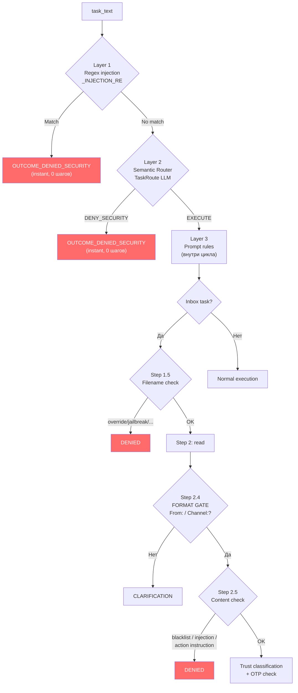

**Слабые места:**
1. **Layer 1** (regex): легко обойти вариациями написания ("1gnore prev1ous")
2. **Layer 2** (LLM router): non-deterministic, ошибка → fallback EXECUTE
3. **Layer 3** (prompt): зависит от compliance LLM с 246 строками правил

---

## 9. Рекомендации

### 9.1 Матрица приоритетов

| Влияние / Усилие | Низкое усилие | Среднее усилие | Высокое усилие |
|:---:|:---:|:---:|:---:|
| **Высокое влияние** | T=0+seed, Кэш TaskRoute | Resolve contradictions, Code enforce write scope | Prompt < 100 lines, Regression tests |
| **Среднее влияние** | Step-based timeout | Anthropic JSON fallback | Split run_loop() |
| **Низкое влияние** | Persist capability cache | | |

### 9.2 Tier 1: Быстрые wins (оценка: устранят ~60% нестабильности)

| # | Действие | Файл | Обоснование |
|---|----------|------|-------------|
| 1 | **T=0 + seed для default/think профилей** | `models.json` | Главный источник вариабельности. Classifier уже T=0/seed=0 — распространить на все, выбрав ненулевой seed |
| 2 | **Кэшировать TaskRoute по хэшу task_text** | `loop.py` | Одна задача → один route. Добавить `dict` (или file-based кэш) |
| 3 | **Разрешить OTP vs MANDATORY** | `prompt.py` | Добавить explicit: "Steps 4-5 skipped when channel is admin or OTP-elevated" в Step 5 |
| 4 | **Передать temperature в Anthropic SDK** | `loop.py:593` | `create_kwargs["temperature"] = cfg.get("temperature", 0)` |

### 9.3 Tier 2: Структурные улучшения

| # | Действие | Обоснование |
|---|----------|-------------|
| 5 | **Code enforcement для write scope** | `dispatch()` или `run_loop()` — whitelist разрешённых путей на основе task_type |
| 6 | **Anthropic JSON extraction fallback** | `loop.py:628` — вместо `return None` попробовать `_extract_json_from_text(raw)` |
| 7 | **Разбить run_loop() на функции** | `_pre_route()`, `_execute_step()`, `_post_dispatch()`, `_handle_error()` |
| 8 | **Persist capability cache** | Сохранять `_CAPABILITY_CACHE` в файл между запусками |

### 9.4 Tier 3: Системный редизайн

| # | Действие | Обоснование |
|---|----------|-------------|
| 9 | **Сократить промпт до ~100 строк** | Вынести inbox/email/delete workflows в code-level state machines |
| 10 | **Убрать FIX-аннотации из промпта** | LLM не нужны номера фиксов — они занимают токены и отвлекают |
| 11 | **Regression test suite** | Fixed task + expected route + expected outcome → ловить регрессии автоматически |

---

## 10. Сводная таблица рисков

| Риск | Severity | Где | Воспроизводимость |
|------|----------|-----|-------------------|
| Temperature > 0 без seed | 🔴 CRITICAL | models.json, loop.py | Каждый запуск |
| TaskRoute не кэширован | 🔴 CRITICAL | loop.py:1020-1036 | Каждый запуск |
| OTP vs MANDATORY противоречие | 🔴 CRITICAL | prompt.py:204 vs 225 | Inbox + OTP задачи |
| Write scope только в промпте | 🟡 HIGH | prompt.py:62 | Зависит от модели |
| JSON extraction order-dependent | 🟡 HIGH | loop.py:392-416 | Multi-object ответы |
| Anthropic нет JSON fallback | 🟡 HIGH | loop.py:628-632 | При невалидном JSON |
| run_loop() 418 строк / 6 уровней | 🟡 HIGH | loop.py:933-1350 | Каждый FIX усугубляет |
| Prephase AGENTS.MD фильтрация | 🟡 HIGH | prephase.py | Разные формулировки задачи |
| Wall-clock timeout | 🟢 MEDIUM | loop.py:1080 | Под нагрузкой |
| Stall hint feedback loop | 🟢 MEDIUM | loop.py:674-727 | Длинные задачи |
| Capability cache in-memory | 🟢 MEDIUM | dispatch.py:255 | Между запусками |
| Log compaction потеря контекста | 🟢 MEDIUM | loop.py:73-270 | Задачи >14 шагов |

---

## Заключение

Агент pac1-py — зрелый, но перегруженный фиксами фреймворк. 182 FIX'а при 3300 строках кода (~1 FIX / 18 строк) создали систему, где каждое изменение рискует вызвать регрессию.

**Корневая проблема:** non-determinism на 3 уровнях одновременно:
1. **Sampling** (T > 0, no seed) — модель отвечает по-разному на один промпт
2. **Routing** (TaskRoute без кэша) — задача маршрутизируется по-разному
3. **Prompting** (противоречия, неоднозначности) — LLM интерпретирует правила по-разному

Путь к 90-95% стабильности лежит **не через FIX-183+**, а через:
- **Детерминированный sampling** (T=0, seed) — убирает уровень 1
- **Кэширование routing** — убирает уровень 2
- **Упрощение промпта + code enforcement** — убирает уровень 3
