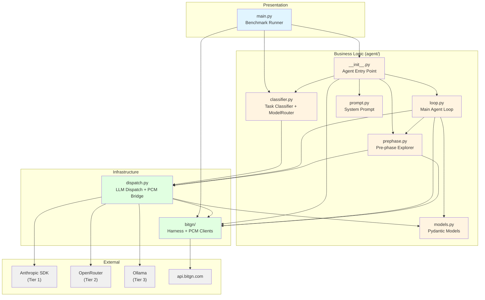

# pac1-py Architecture Documentation

Generated: 2026-03-26 | Complexity: **Standard** | Fix counter: FIX-77 (FIX-78 is next)

## Overview

**pac1-py** is a file-system agent for the BitGN PAC1 benchmark. It manages a personal knowledge vault through the PCM runtime (9 tools: tree/find/search/list/read/write/delete/mkdir/move + report_completion) using a discovery-first prompt strategy and a three-tier LLM dispatch stack.

**Benchmark results:**
- `anthropic/claude-sonnet-4.6` — 100.00% on bitgn/pac1-dev
- `qwen/qwen3.5-9b` (OpenRouter) — 100.00% on bitgn/pac1-dev
- `anthropic/claude-haiku-4.5` — ~97% on bitgn/pac1-dev

## Files

| File | Description |
|------|-------------|
| [overview.yaml](overview.yaml) | Components, dependencies, quality attributes, env vars |
| [diagrams/dependency-graph.md](diagrams/dependency-graph.md) | Mermaid component dependency graph |
| [diagrams/data-flow-agent-execution.md](diagrams/data-flow-agent-execution.md) | Mermaid sequence diagram — full task execution flow |
| [diagrams/data-flow-llm-dispatch.md](diagrams/data-flow-llm-dispatch.md) | Mermaid flowchart — three-tier LLM dispatch with fallback |

## Architecture at a Glance

```
main.py  →  run_agent() [__init__.py]
              ├── ModelRouter.resolve_llm() [classifier.py]  ← FIX-75: LLM classification
              ├── run_prephase() [prephase.py]               ← tree + AGENTS.MD + context
              └── run_loop() [loop.py]                       ← 30-step loop
                    ├── compact log (prefix + last 5 pairs)
                    ├── _call_llm() → NextStep [dispatch.py]
                    │     ├── Tier 1: Anthropic SDK (native thinking)
                    │     ├── Tier 2: OpenRouter (FIX-27 retry)
                    │     └── Tier 3: Ollama (local fallback)
                    ├── stall detection [FIX-74]
                    └── dispatch tool → PcmRuntimeClientSync [bitgn/]
```

## Component Dependency Graph



## Key Architectural Patterns

### Discovery-First Prompt
Zero hardcoded vault paths in the system prompt. The agent discovers folder roles from AGENTS.MD and vault tree pre-loaded in prephase context.

### Three-Tier LLM Fallback
`Anthropic SDK → OpenRouter → Ollama` with FIX-27 retry (4 attempts, 4s sleep) on transient errors (503/502/429).

### Adaptive Stall Detection (FIX-74)
Three task-agnostic signals:
1. Same tool+args fingerprint 3x in a row
2. Same path error 2+ times
3. 6+ steps without write/delete/move/mkdir

### Hardcode Fix Pattern
Each behavioral fix gets a sequential label `FIX-N` in code comments. Current counter: FIX-77.

## Components (8 total)

```toon
components[8]{id,type,path,layer}:
  main,entry_point,main.py,presentation
  agent-init,module,agent/__init__.py,business
  classifier,module,agent/classifier.py,business
  dispatch,module,agent/dispatch.py,infrastructure
  loop,module,agent/loop.py,business
  prephase,module,agent/prephase.py,business
  prompt,config,agent/prompt.py,business
  models,data_model,agent/models.py,business
```

## Dependencies (18 total)

```toon
dependency_graph:
  edges[18]{from,to,type}:
    main,agent-init,required
    main,classifier,required
    main,bitgn-harness,required
    agent-init,classifier,required
    agent-init,prephase,required
    agent-init,loop,required
    agent-init,prompt,required
    agent-init,bitgn-harness,required
    classifier,dispatch,required
    loop,dispatch,required
    loop,models,required
    loop,prephase,required
    loop,bitgn-harness,required
    prephase,dispatch,required
    prephase,bitgn-harness,required
    dispatch,models,required
    dispatch,anthropic-sdk,required
    dispatch,openrouter,optional
```
