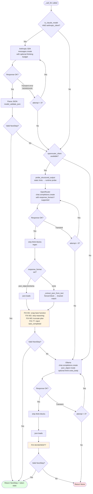

# pac1-py — LLM Dispatch Three-Tier Flow

Generated: 2026-03-26

```mermaid
flowchart TD
    START([_call_llm called]) --> IS_CLAUDE{is_claude_model\nAND anthropic_client?}

    IS_CLAUDE -- Yes --> ANT_CALL[Anthropic SDK\nmessages.create\nwith optional thinking budget]
    IS_CLAUDE -- No --> OR_CHECK{openrouter_client\navailable?}

    ANT_CALL --> ANT_OK{Response OK?}
    ANT_OK -- Yes --> ANT_PARSE[Parse JSON\nmodel_validate_json]
    ANT_PARSE --> ANT_VALID{Valid NextStep?}
    ANT_VALID -- Yes --> RETURN_OK([Return NextStep + token stats])
    ANT_VALID -- No --> OR_CHECK
    ANT_OK -- Transient error\n503/502/429 --> ANT_RETRY{attempt < 3?}
    ANT_RETRY -- Yes --> ANT_CALL
    ANT_RETRY -- No --> OR_CHECK

    OR_CHECK -- Yes --> PROBE[probe_structured_output\nstatic hints → runtime probe]
    PROBE --> OR_CALL[OpenRouter\nchat.completions.create\nwith response_format if supported]
    OR_CALL --> OR_OK{Response OK?}
    OR_OK -- Yes --> STRIP_THINK[strip think blocks\nregex]
    STRIP_THINK --> OR_PARSE{response_format\nset?}
    OR_PARSE -- json_object/schema --> JSON_LOAD[json.loads]
    OR_PARSE -- none --> EXTRACT[_extract_json_from_text\nfenced block → bracket match]
    JSON_LOAD --> FIX_W[FIX-W1: wrap bare function\nFIX-W2: strip reasoning\nFIX-W3: truncate plan\nFIX-77: inject task_completed]
    EXTRACT --> FIX_W
    FIX_W --> OR_VALID{Valid NextStep?}
    OR_VALID -- Yes --> RETURN_OK
    OR_VALID -- No --> OLLAMA_CALL
    OR_OK -- Transient --> OR_RETRY{attempt < 3?}
    OR_RETRY -- Yes --> OR_CALL
    OR_RETRY -- No --> OLLAMA_CALL

    OR_CHECK -- No --> OLLAMA_CALL

    OLLAMA_CALL[Ollama\nchat.completions.create\njson_object mode\noptional think extra_body]
    OLLAMA_CALL --> OLL_OK{Response OK?}
    OLL_OK -- Yes --> STRIP_THINK2[strip think blocks]
    STRIP_THINK2 --> JSON_LOAD2[json.loads]
    JSON_LOAD2 --> FIX_W2_[FIX-W1/W2/W3/77]
    FIX_W2_ --> OLL_VALID{Valid NextStep?}
    OLL_VALID -- Yes --> RETURN_OK
    OLL_VALID -- No --> RETURN_NONE([Return None])
    OLL_OK -- Transient --> OLL_RETRY{attempt < 3?}
    OLL_RETRY -- Yes --> OLLAMA_CALL
    OLL_RETRY -- No --> RETURN_NONE

    style RETURN_OK fill:#e1ffe1
    style RETURN_NONE fill:#ffe1e1
    style FIX_W fill:#fff4e1
    style FIX_W2_ fill:#fff4e1
```
