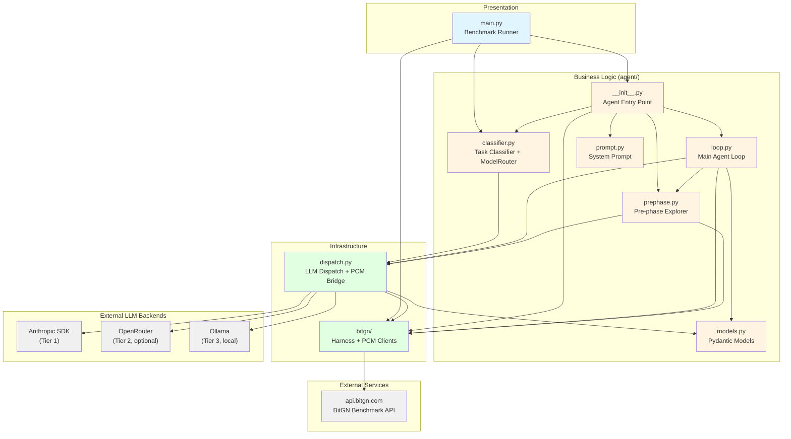

# pac1-py — Component Dependency Graph

Generated: 2026-03-26

## Layer Legend

| Color | Layer | Description |
|-------|-------|-------------|
| Light blue | Presentation | Entry point / benchmark runner |
| Light yellow | Business | Agent logic, classifier, prompt, models |
| Light green | Infrastructure | LLM dispatch, PCM/harness clients |
| Gray | External | Third-party APIs and LLM backends |
