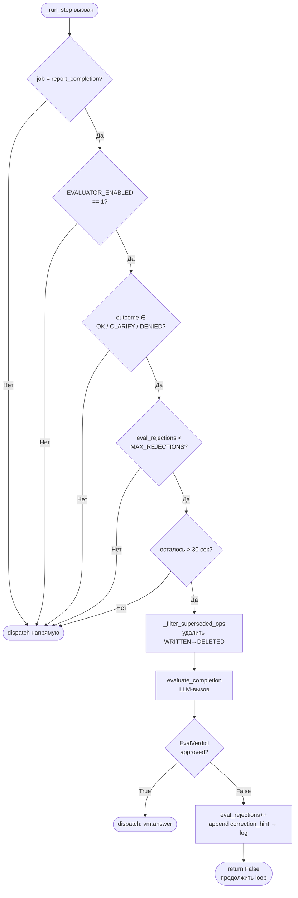
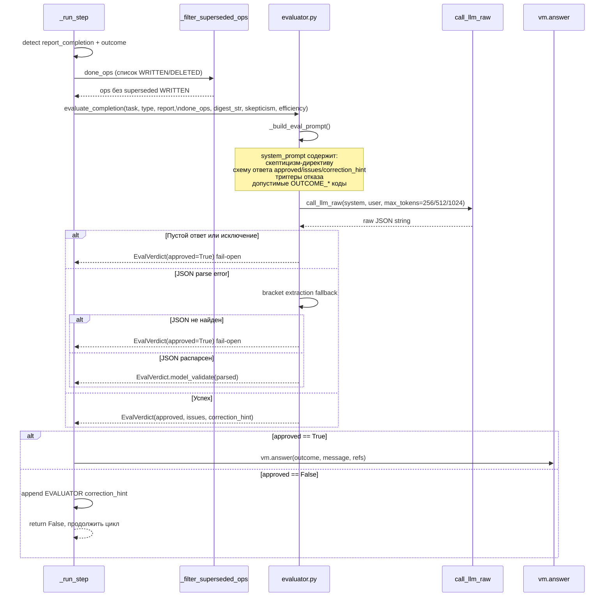
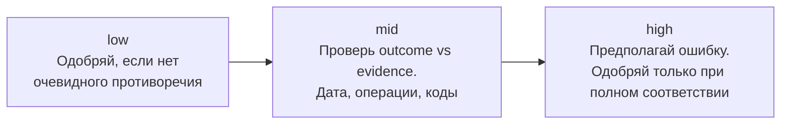
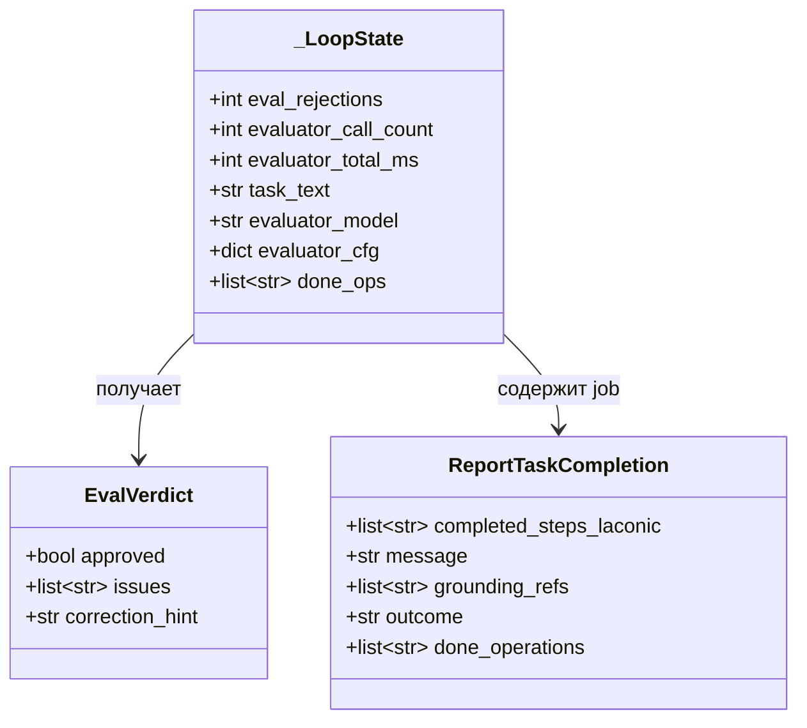
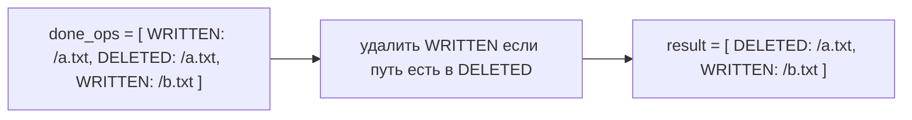
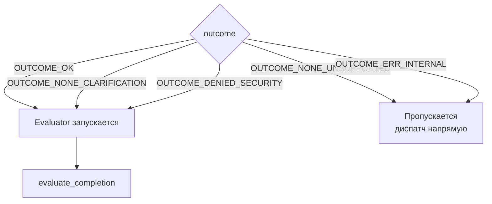
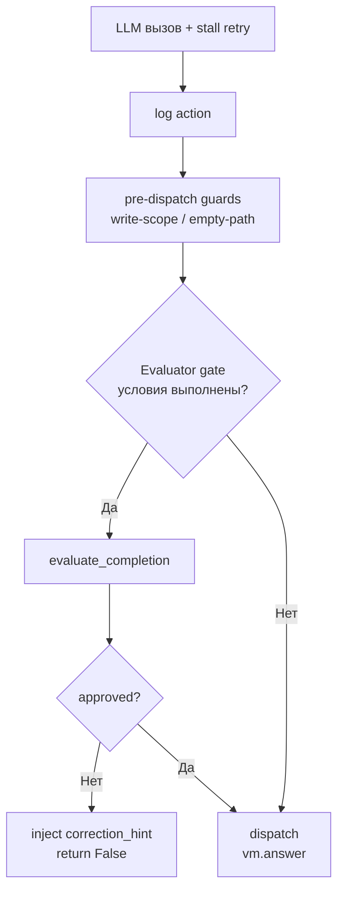

# pac1-py — Evaluator (Critic Gate)

Generated: 2026-04-05 | Fix counter: FIX-224 (FIX-225 is next)

## Назначение

Evaluator — качество-гейт, который перехватывает завершение задачи **до** финального `vm.answer()`.
LLM-критик проверяет: совпадает ли заявленный исход с реальными операциями и текстом задачи.

Дизайн: **fail-open** — любая ошибка LLM/парсинга → автоматическое одобрение.

---

## Поток управления



---

## Детальный поток evaluator



---

## Конфигурация

| Env var | По умолчанию | Допустимые значения | Описание |
|---------|-------------|---------------------|----------|
| `EVALUATOR_ENABLED` | `"0"` | `"0"` / `"1"` | Включить evaluator |
| `MODEL_EVALUATOR` | = `MODEL_DEFAULT` | любой model id | Модель для evaluator |
| `EVAL_SKEPTICISM` | `"mid"` | `low` / `mid` / `high` | Строгость проверки |
| `EVAL_EFFICIENCY` | `"mid"` | `low` / `mid` / `high` | Глубина контекста |
| `EVAL_MAX_REJECTIONS` | `"2"` | целое число | Макс. отказов до принудительного пропуска |

### Уровни скептицизма



### Уровни efficiency → токены + контекст

| Level | max_tokens | Включено в user_msg |
|-------|-----------|---------------------|
| `low` | 256 | TASK + PROPOSED_OUTCOME + AGENT_MESSAGE |
| `mid` | 512 | + SERVER_DONE_OPS + AGENT_REPORTED_OPS + COMPLETED_STEPS |
| `high` | 1024 | + STEP_DIGEST (полный дайджест шагов) |

---

## Модели данных



---

## _filter_superseded_ops

Удаляет `WRITTEN` записи для путей, которые позже были `DELETED`.



**Почему важно (FIX-223):** Evaluator ранее отклонял OUTCOME_OK, видя `WRITTEN: /file` + `DELETED: /file` — трактовал как «файл создан, но не удалён». Фильтр устраняет ложные отказы.

---

## Какие outcomes проверяются



**Исключение (FIX-224):** inbox-задачи могут получить OUTCOME_OK с пустым `SERVER_DONE_OPS` — ответ в `report.message` без мутаций файлов считается валидным.

---

## Интеграция в _run_step



---

## Статистика в итоговой таблице

`main.py` выводит после каждой задачи:

```
eval_calls=N  eval_rejections=N  eval_ms=NNNms
```

Поля берутся из `_LoopState`: `evaluator_call_count`, `eval_rejections`, `evaluator_total_ms`.

---

## Файлы

| Файл | Роль |
|------|------|
| `agent/evaluator.py` | `evaluate_completion()`, `_build_eval_prompt()`, `EvalVerdict` |
| `agent/loop.py:40-47` | Env vars: `_EVALUATOR_ENABLED`, `_EVAL_SKEPTICISM`, `_EVAL_EFFICIENCY`, `_MAX_EVAL_REJECTIONS` |
| `agent/loop.py:942-947` | `_filter_superseded_ops()` |
| `agent/loop.py:1624-1657` | Evaluator gate в `_run_step()` |
| `agent/classifier.py:297` | `ModelRouter.evaluator` поле |
| `agent/__init__.py:37-43` | Резолюция `evaluator_model` + `evaluator_cfg` |
